## Command Query Responsibility Segregation (CQRS) and Event Sourcing

## Project Overview

In a CQRS (Command Query Responsibility Segregation) architecture, the read and write sides are typically separate.

## Screenshots

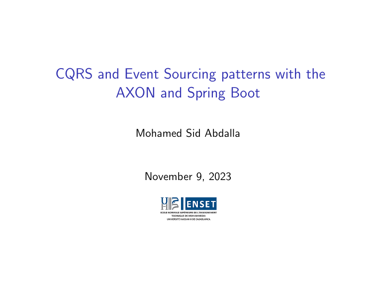
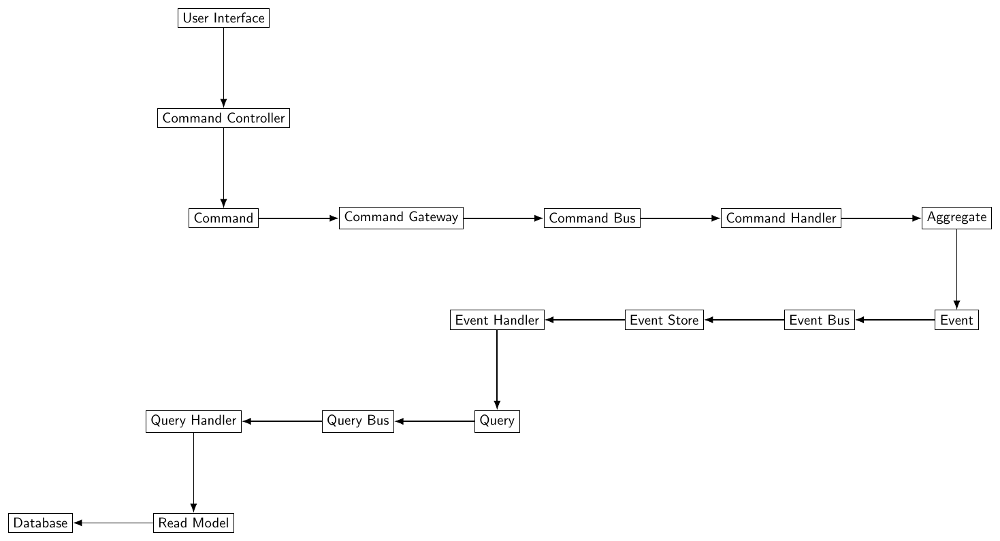
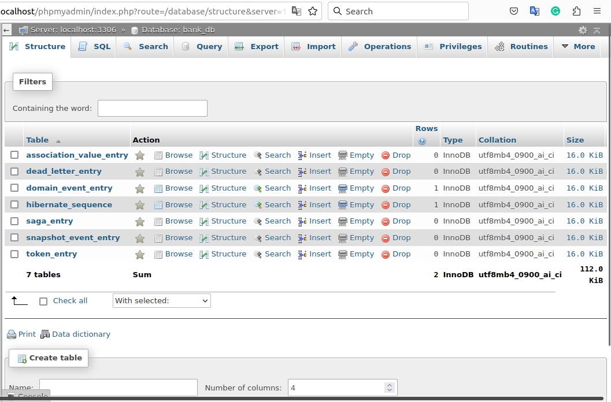
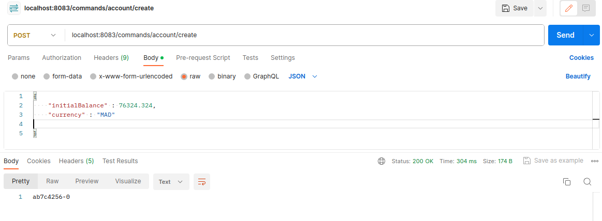
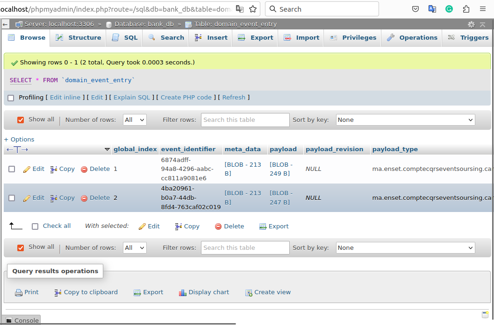
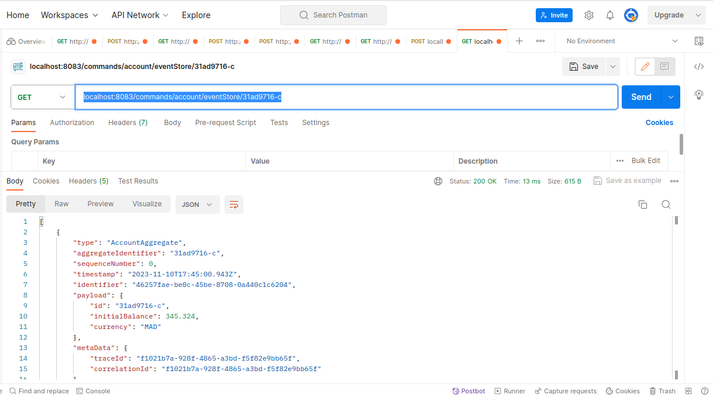
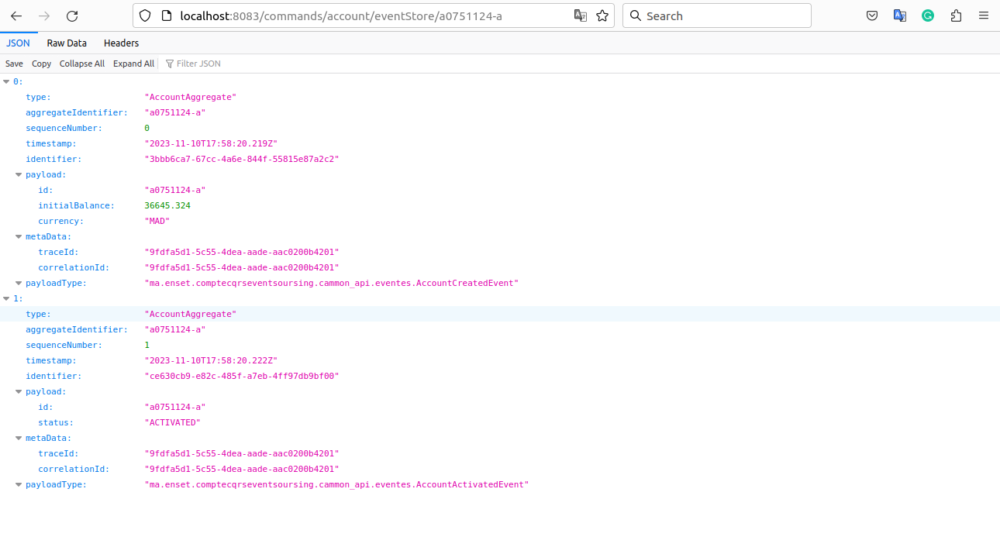
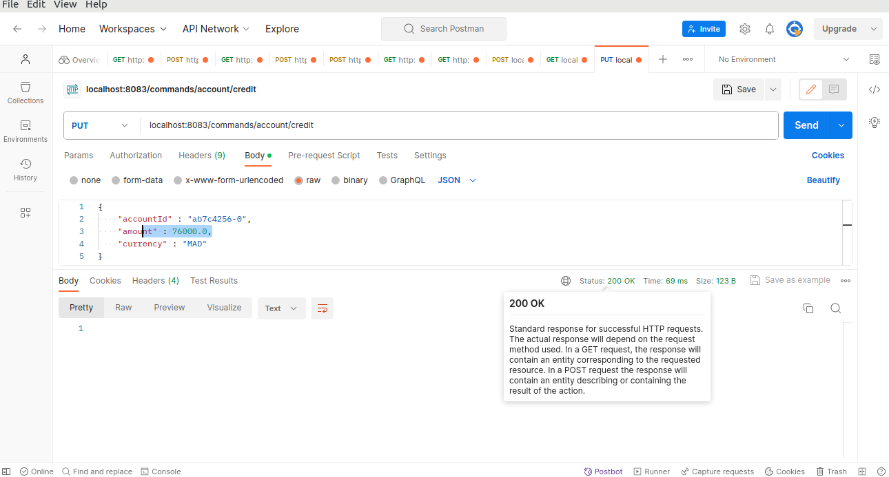
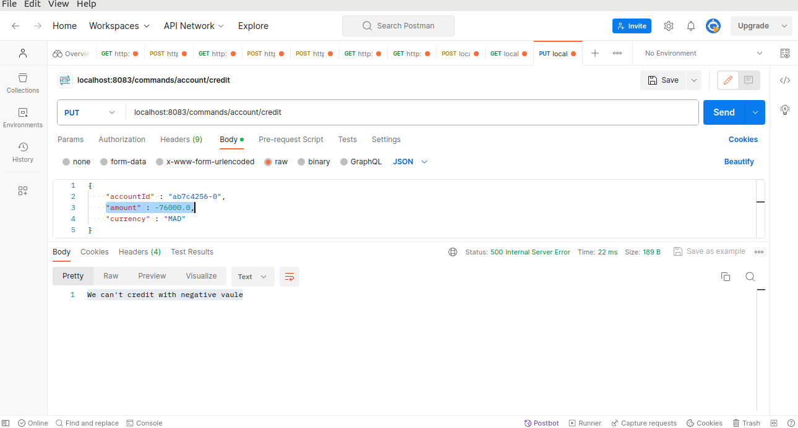
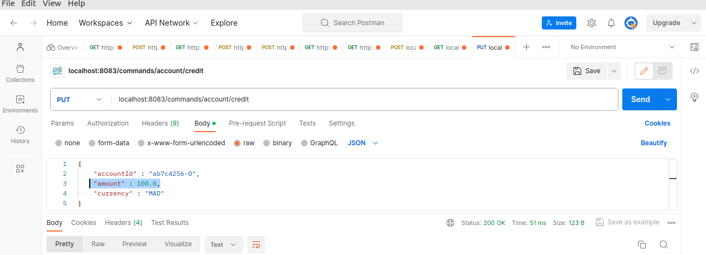
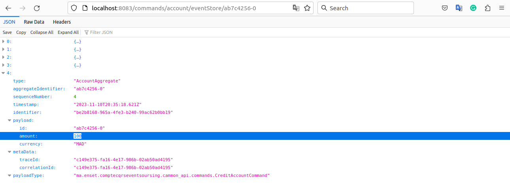
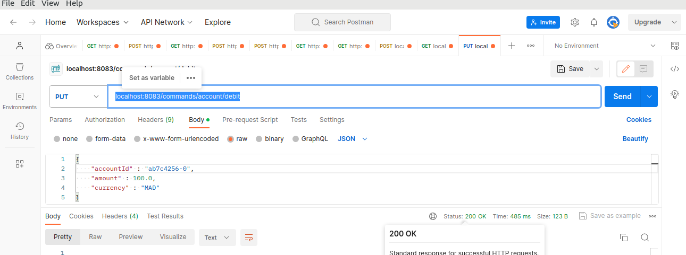
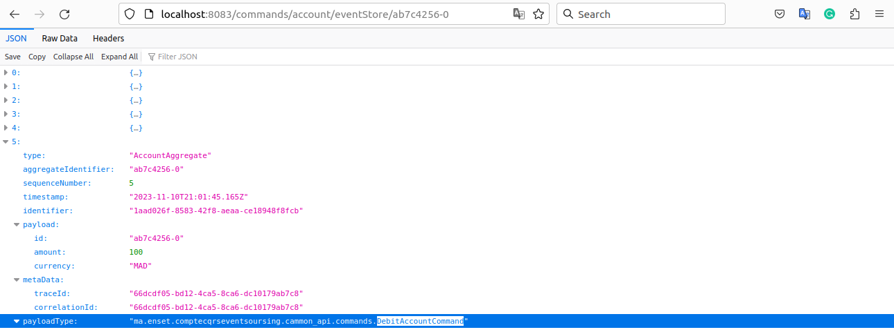
